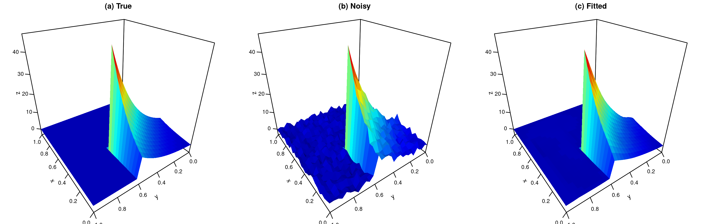

# mlabs

### Overview

The `mlabs` package implements Multivariate Lévy Adaptive B-Spline Regression (MLABS), a Bayesian nonparametric model based on sparse expansions of low-order tensor-product B-splines. It learns basis size, active predictors, interaction orders, spline degrees, and knot locations to capture nonlinear effects and heterogeneous smoothness. Posterior inference uses reversible-jump MCMC with Bayesian backfitting, collapsed updates, and residual-guided proposals. The package provides prediction, posterior summaries, and diagnostic plots.

### Installation

#### Option 1: Install from GitHub

```r
if (!requireNamespace("devtools", quietly = TRUE)) {
  install.packages("devtools")
}
devtools::install_github("swpark0413/mlabs")
```

#### Option 2: Install from a source archive

Download the package archive from the [Releases](https://github.com/swpark0413/mlabs/releases/) page, then install it:

```r
# Replace the path with the location of your downloaded file.
install.packages("~/path/mlabs_1.0.0.tar.gz", type = "source", repos = NULL)
```

Installation from source requires a C++ toolchain (Rtools on Windows or the Xcode command line tools on macOS), together with `Rcpp` and `RcppArmadillo`. The plotting functions additionally use `ggplot2`, `patchwork`, and `scales`.

### Example

Generate observations on a regular grid and fit the Genz discontinuous surface:

```r
library(mlabs)

genz <- function(X) {
  inside <- X[, 1] <= 0.4 & X[, 2] <= 0.6
  value <- numeric(nrow(X))
  value[inside] <- exp(4 * X[inside, 1] + 4 * X[inside, 2])
  value
}

set.seed(413)
grid <- seq(0, 1, length.out = 30L)
X <- as.matrix(expand.grid(x = grid, y = grid))
signal <- genz(X)
y <- signal + rnorm(nrow(X), sd = sd(signal) / 5)

# Fit MLABS with degrees {0, 1, 2} and two-way basis functions.
iter   <- 100000L
burnin <- 50000L
thin   <- 10L

fit <- mlabs::mlabs_collapsed(
  y = y,
  X = X,
  nmcmc = iter,
  nburn = burnin,
  nthin = thin,
  maxInt = 2,
  allowed_degrees = c(0, 1, 2),
  aJ = 5,
  shrink_c = 3,
  k_weights = c(0, 1)
)

# Predictive accuracy on an independent test set.
X_test <- matrix(runif(2000), ncol = 2)
pred <- predict(fit, newdata = X_test, type = "mean")
sqrt(mean((pred - genz(X_test))^2))

# Posterior summaries and MCMC diagnostics.
summary(fit)
```



*Genz discontinuous surface: (a) true surface, (b) noisy observations on a 30 × 30 grid, and (c) fitted posterior mean surface.*


### Citation

If you use `mlabs` in your research, please cite:

- Sewon Park, Jeunghun Oh, and Jaeyong Lee. Multivariate Lévy adaptive B-spline regression. arXiv:2108.11863.

The univariate predecessor is described in:

- Sewon Park, Hee-Seok Oh, and Jaeyong Lee. Lévy adaptive B-spline regression via overcomplete systems. *Statistica Sinica*, 33(4), 2715–2737, 2023.

### License

The package is distributed under the GPL-3.0 license. See the [`LICENSE`](LICENSE) file for more details
